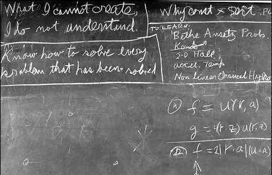

# Introduction
Gradient descent is among *the* most important algorithms in machine learning and is the defacto standard for optimizing deep learning networks. First introduced by Louis Augustin Cauchy in 1847 [@Cauchy1847Methode], Gradient Descent has evolved into a family of optimization algorithms and is now the workhorse behind state-of-the-art deep learning frameworks such as Keras [@chollet2015keras], TensorFlow [@tensorflow2015-whitepaper], Caffe [@jia2014caffe], Lasagne [@lasagne], and PyTorch [@paszke2017automatic], to name a few. 

In this __part series, we will build a custom, extensible, and modular Gradient Descent lab from the ground up. It will include gradient-based implementations of:

* Linear Lasso, Ridge, and ElasticNet Regression,   
* Logistic Regression, and    
* Multinomial Classification   

Our package will support:    

* batch, minibatch, and stochastic Gradient Descent,   
* regularization methods such as lasso, ridge, and elastic net regression    
* learning rate decay schedules such as time, step, and exponential decay 
* various early stopping approaches

Once we have a working model, we will analyze and interpret the effects of various hyperparameter settings on algorithm performance, evaluate performance for real-world case studies, and compare our models with the [scikit-learn](https://scikit-learn.org/stable/)  [SGDRegressor](https://scikit-learn.org/stable/modules/generated/sklearn.linear_model.SGDRegressor.html) and [SGDClassifier](https://scikit-learn.org/stable/modules/generated/sklearn.linear_model.SGDClassifier.html) modules.

## Learning Objectives
The overall goal is to understand Gradient Descent, its applications, and variants so that we can:  

* Meet a wider range of real-world optimization challenges, independent of specific frameworks   
* Customize and apply existing frameworks more effectively     
* Create custom implementations of algorithms for learning, specialization, or experimentation purposes

Over the coming sections, we will: 

* introduce Gradient Descent and evaluate the variants' strengths and weaknesses
* explore the theory and mathematics behind gradient based optimization    
* implement the three variants, batch, stochastic, and minibatch Gradient Descent     
* develop linear regression, logistic regression, and multinomial classification modules     
* analyze the effect of hyperparameters on algorithm behavior, performance, and speed         
* apply the algorithm to a real-world linear regression, logistic regression and classification problem
* evaluate its performance vis-a-vis that of the [scikit-learn](https://scikit-learn.org/stable/)  [SGDRegressor](https://scikit-learn.org/stable/modules/generated/sklearn.linear_model.SGDRegressor.html) and [SGDClassifier](https://scikit-learn.org/stable/modules/generated/sklearn.linear_model.SGDClassifier.html) modules.

## Cases     
Throughout this series, we will be using three of the most widely used datasets in machine learning.    
* [Boston Housing Dataset (Regression)](https://scikit-learn.org/stable/modules/generated/sklearn.datasets.load_boston.html)     
* [Wisconson Breast Cancer Dataset (Binary Classification)](https://scikit-learn.org/stable/modules/generated/sklearn.datasets.load_breast_cancer.html)    
* [The Iris Dataset](https://scikit-learn.org/stable/modules/generated/sklearn.datasets.load_iris.html)

Courtesy of the good folks at sckikit-learn, we can benchmark the performance of our implementations against those of other researchers and practitioners on the interwebs.

## Why implement machine learning algorithms from scratch?

Why build machine learning algorithms from scratch when there is no dearth of highly optimized and tested open-source packages and frameworks that I can use out-of-the-box without a deep understanding of optimization methods, gradients and loss functions. Is the return worth the investment in time? 

`r kfigr::figr(label = "feynman", prefix = TRUE, link = TRUE, type="Figure")` (Richard Feynman, February 15, 1988) &copy; California Institute of Technology 

Well, there are several reasons why building an algorithm from scratch may make sense:

* **Learning motivation.** The relative ease with which existing libraries can be deployed can create the illusion of competence when the underlying data science is not well understood. Paraphrasing theoretical physicist, Richard Feynman, we don't understand that which we cannot create. Building machine learning algorithms deepens our intuition into the algorithm's behavior, reveals the effects of their hyperparameters and reinforces the underlying mathematical principles. Consequently we:    

  + gain a deeper appreciation for existing, battle-tested, and optimized implementations,   
  + adapt to new frameworks and APIs with greater agility,   
  + explain, with greater credibility, how and why an algorithm performs to colleagues and stakeholders    
  
* **Specialization** We may need to create a custom implementation because we are not satisfied with the 'features' of existing implementations. Suppose they don't support KL Divergence loss or cyclical learning rate schedules with stochastic Gradient Descent. Perhaps you've discovered a research paper describing an innovative approach to early stopping and you want to run computational complexity experiments. By implementing algorithms, we are able to fine-tune the functionality to suit specific project requirements. This can improve predictive or computational performance.

* **Experimentation** Once you've implemented a machine learning algorithm, you can perform studies to evaluate the predictive and computational performance of various parameters and new functionality. This can lead to new insights and discoveries for future implementations that you can contribute and promote.

## Organization
This explanatory series is comprised of the following eight sections:    

1. Introduction to Gradient Descent     
2. Gradient Descent From Scratch I: Regression 
2. Gradient Descent From Scratch II: Binary Classification 
2. Gradient Descent From Scratch III: Multinomial Classification 
3. Gradient Descent From Scratch IV: Learning Rate Schedules          
4. Gradient Descent From Scratch V: Early Stopping                 
5. Gradient Descent From Scratch VI: Optimization Algorithms            

## Prerequisites
This series assumes the reader has a basic to intermediate facility with the Python programming language. You should also be familiar with the [Numpy](http://www.numpy.org/) and [Pandas](https://pandas.pydata.org/) libraries.  Exposure to the [scikit-learn](https://scikit-learn.org/stable/) library would be advantageous, but is not required. Some background in multivariate calculus is also useful but not required.