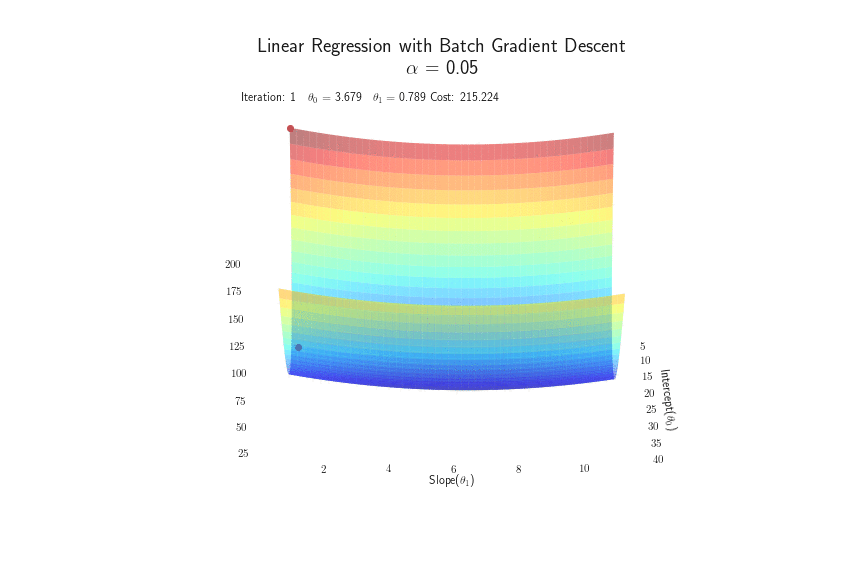
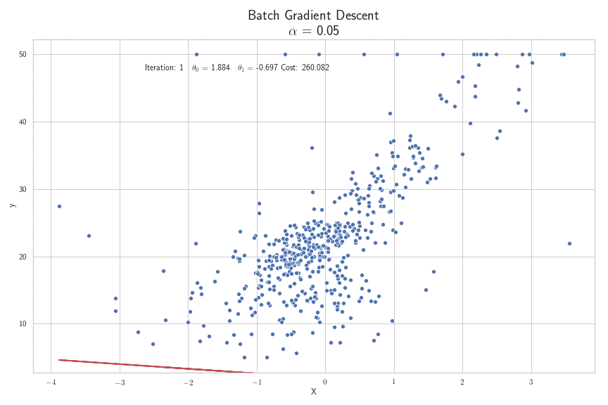

<script type="text/x-mathjax-config">
MathJax.Hub.Config({
TeX: {
equationNumbers: {
autoNumber: "all",
formatNumber: function (n) {return ''+n}
}
}});</script>

# Gradient Descent Applications
This is section __ of a 6-part series on Gradient Descent. In the prior section, we examined the calculus behind gradient descent. Here, we will apply what we learned to apply gradient descent to regression and classification tasks, namely:    

* Linear Regression    
* Logistic Regression    
* Multinomial Logistic Regression    

By the close of this section, you should be able to:     

* Destinguish the hypothesis functions for regression and classification settings    
* Define the cost functions appropriate to regression and classification applications   
* Derive the gradient of the cost functions with respect to parameters    
* Describe the gradient descent, regression and classification, update rules

Let's get started.

## Linear Regression using Gradient Descent
Linear regression, the most widely used of all statistical techniques, is the study of linear, additive relationships between variables. We start with an input vector $x^T=(x_1, x_2, \dots, x_n)$, the *independent* variables, and we want to predict a real-valued output $y$, otherwised called the *dependent* variable. 

### Linear Regression Hypothesis Function
To render a real-valued prediction, we need a function, a hypothesis function $h_\theta(x):x\to y$, of the form:
$$h_\theta(x)=\theta_0+\displaystyle\sum_{i=1}^n\theta_ix_i$$
where:   
* $\theta_0$ is the bias term     
* $\theta_i$ is the $i$th coefficient, or parameter    
* $x_i$ is the $i$th variable in $x$    
* $n$ is the number of variables or features in $x$    

The central property of this function is that the prediction $y$ is a linear function of each of the $x$ variables, holding the others constant. Each parameter $\theta_1, \theta_2, \dots, \theta_n$ is a real number, and is associated with one of the input features $x_1, x_2, \dots, x_n$. The parameter $\theta_j$ represents how important that input $x_j$ is to the hypothesis or prediction. The additional constant $\theta_0$, the bias or intercept term, is the prediction that the model would make if all the $x$'s were zero.

To simplify our notation, we can add an intercept term $x_0=1$ to our feature vector $x$. We can now represent our hypothesis in the *vectorized* form:
$$h_\theta(x)=\displaystyle\sum_{i=0}^n\theta_ix_i=\theta^Tx$$
### Linear Regression Cost Function
Having defined our prediction function, our next step is to specify a *cost* function to measure the quality of our predictions. The overall cost of predicting $\hat{y}$ on the training set when the true values are $y$ is given by:
$$J(\theta)=\frac{1}{2m}\displaystyle\sum_{i=1}^m(h_\theta(x^{(i)})-y^{(i)})^2$$
This **quadratic** function, also known as the least squares cost function, is convex with a single global minimum, well suited for gradient descent optimization.

### Gradient of the Linear Regression Cost Function
Recall, the gradient, $\nabla J(\theta)$, is a vector-valued function, in which the vector contains the partial derivatives of the cost function with respect to each of the parameters $\theta$. We derive $\nabla J(\theta)$ as follows:

$$
\begin{equation}
\begin{split}
\frac{\partial}{\partial\theta_j}J(\theta)&=\frac{\partial}{\partial \theta_j}\bigg(\frac{1}{2m}\displaystyle\sum_{i=1}^m(h_\theta(x^{(i)})-y^{(i)})^2\bigg)\\
\frac{\partial}{\partial\theta_j}J(\theta)&=\frac{1}{2m}\displaystyle\sum_{i=1}^m\frac{\partial}{\partial \theta_j}(h_\theta(x^{(i)})-y^{(i)})^2\hspace{50mm}\text{derivative of sum is sum of derivative}\\
\frac{\partial}{\partial\theta_j}&=\frac{1}{2m}\displaystyle\sum_{i=1}^m2(h_\theta(x^{(i)})-y^{(i)})\frac{\partial}{\partial \theta_j}(h_\theta(x^{(i)})-y^{(i)})\hspace{22mm}\text{power+chain rule}\\
\frac{\partial}{\partial\theta_j}&=\frac{1}{2m}\displaystyle\sum_{i=1}^m2(h_\theta(x^{(i)})-y^{(i)})\frac{\partial}{\partial \theta_j}(\displaystyle\sum_{j=0}^n\theta_j^Tx_j^{(i)}-y^{(i)})\hspace{17mm}\text{substituting}\space \theta^Tx\\
\nabla J_\theta&=\frac{\partial}{\partial\theta_j}=\frac{1}{m}\displaystyle\sum_{i=1}^m(h_\theta(x^{(i)})-y^{(i)})x_j^{(i)}\space(\text{for every j})\hspace{19mm}\text{power rule+algebraic simplification}
\end{split}
\end{equation}
$$
Again, this formulation assumes that we have included an intercept term $x_0=1$

### Linear Regression with Gradient Descent Parameter Update Rule
Now that we have our gradient, we can iteratively apply the least mean squares (LMS) update rule.
$$
\theta_j := \theta_j-\alpha\nabla J_\theta
$$
The LMS update rule has several properties that seem natural. For instance, we update the parameters $\theta$ by *subtracting* the scaled gradient in order to move in the direction of steepest *descent*. In addition, the magnitude of the update is proportional to the **error** term $h_\theta(x^{(i)})-y^{(i)}$. If we encounter large errors in our training batch, the magnitude of the gradient is higher resulting in a larger change to the parameters $\theta$. On the other hand, if our predictions are close to the true values $y$, our error term is smaller, resulting in smaller changes to the parameters. Lastly, gradient descent can be susceptible to local minima; however, the error manifold for the linear regression cost function is convex and as such, has only a single global minimum.

### Linear Regression Example
For this example, we will use the Boston Housing Dataset, which contains 506 examples, 14 predictors and a single target variable MEDV - the median value of owner-occupied homes in $1000's. For visualization purposes, we will restrict ourselves to a single predictor RM - the average number of rooms per dwelling.
```{r boston, echo=FALSE}
htmltools::includeHTML("./content/figures/boston.html")
```
`r kfigr::figr(label = "boston", prefix = TRUE, link = TRUE, type="Figure")`: Boston Housing Prices by Average Number of Rooms

Let's run linear regression with gradient descent for 50 epochs with a learning rate $\alpha=0.05$


`r kfigr::figr(label = "linear_regression_search", prefix = TRUE, link = TRUE, type="Figure")`: Linear Regression Gradient Descent Search Trajectory

The U-shape represents the shape of the quadratic function. On the horizontal axes we have $\theta_0$, the intercept parameter and $\theta_1$, the coefficient for the rooms variable. On the vertical axis, we have the associated costs for the parameters $\theta$. The two lines represent the trajectory taken by gradient descent. Note that the true trajectory lies on the $x-y$ axis and is indicated by the blue line. The red line is added to show the projection of the parameters against the error manifold.

This model produces parameters $\theta_0\approx21.005$ and $\theta_1\approx5.935$. If we plot prices versus rooms, we are able to juxtapose the regression lines associated with the parameters $\theta$ from each iteration.




`r kfigr::figr(label = "linear_regression_fit", prefix = TRUE, link = TRUE, type="Figure")`: Linear Regression Fit with Gradient Descent

### Linear Regression Model Representation Summary
To summarize, the linear regression model representation is:
$$
\begin{equation}
\begin{split}
\text{Hypothesis Function}\hspace{30mm}&h_\theta(x)=\theta^Tx\\
\text{Cost Function}\hspace{30mm}&J(\theta)=\frac{1}{2m}\displaystyle\sum_{i=1}^m(h_\theta(x^{(i)})-y^{(i)})^2\\
\text{Gradient}\hspace{30mm}&\nabla{J\theta}=\frac{1}{m}\displaystyle\sum_{i=1}^m(h_\theta(x^{(i)})-y^{(i)})x_j^{(i)}\space(\text{for every j})\\
\text{Parameter Update Rule}\hspace{30mm}&\theta_j := \theta_j-\alpha\nabla J_\theta
\end{split}
\end{equation}
$$

## Logistic Regression using Gradient Descent
Logistic regression is a probabilistic classification algorithm that is used to choose a value $y$ that maximizes $P(Y|X)$, assuming:

* that all training examples are independent and identically distributed random variables,    
* $y$ is a single variable that can take one of two values, typically 0 and 1, and      
* $P(Y|X)$ can be approximated as a *sigmoid* function, $\sigma(z)$ applied to a linear combination, $z$, of input features.    

Furthermore logistic regression assumes:
$$
\begin{equation}
\begin{split}
P(Y=1|X=x)&=\sigma(\theta^Tx) \hspace{30mm} \text{where}\space x_0=1\\
P(Y=0|X=x)&=1-\sigma(\theta^Tx)
\end{split}
\end{equation}
$$
The goal of binary logistic regression is to learn a classifier that can make a binary decision about the class of a new input observation.

### Logistic Regression Hypothesis Function
To make a decision on an instance, the classifier first computes:
$$z=\theta^Tx\label{eq:decision}$$
This should look familiar as it is the hypothesis function for linear regression, which includes the intercept variable $x_0=1$. The resulting single number $z$ expresses the weighted sum of the evidence for the class.

Note, that there is nothing in $\ref{decision}$ that forces $z$ to be a valid probability, that is, to lie between 0 and 1. Fact 'o business, $z$ may be any value on the continuum from $-\infty\space\text{to}\space\infty$. 

To create a valid probability, we'll pass $z$ through the **sigmoid** function, $\sigma(z)$ depicted below.

```{r sigmoid, echo=FALSE}
htmltools::includeHTML("./content/figures/sigmoid.html")
```
`r kfigr::figr(label = "sigmoid", prefix = TRUE, link = TRUE, type="Figure")`: Sigmoid Function

The sigmoid function, also called the **logistic function**, is specified as:
$$y=\sigma(z)=\frac{1}{1+e^{-z}}$$
The sigmoid has several advantages;   

* it takes a real-valued number and maps it into the range $[0,1]$, precisely what we need for a valid probability.    
* it is nearly linear around 0, but has a sharp slope toward the ends. This has the effect of moving outliers towards 0 or 1.     
* it's differentiable!

Now, we have an algorithm that produces the probability $P(y=1|x)$, for a given instance $x$. To convert the probability to a decision, we simply assign the instance to class 1 if $P(y=1|x)>0.5$, and class 0 otherwise.

### Logistic Regression Cost Function
We need a loss function that expresses, for an observation $x$, how close the prediction ($\hat{y}=\sigma(\theta^Tx)$) is to the correct output ($y\in[0,1]$). We do this via a loss function that assumes that the correct class labels of the training examples are *more likely*. Using **conditional maximum likelihood estimation**, we choose the parameters $\theta$ that maximize the log probability of the true $y$ labels in the training data, given the observations $x$. The loss function is the negative log likelihood loss, also known as **cross-entropy loss**.

So, let's derive it for a single observation $x$. We would like to maximize the probability of the correct label $p(y|x)$. Since there are only two discrete outcomes (1 or 0), this is a Bernoulli distribution and we can express the probability $p(y|x)$ that our classifier computes for one observation as follows:
$$p(y|x)=\hat{y}^y(1-\hat{y})^{1-y}$$
For mathematical stability reasons, we take the log of both sides, which is ok because whatever values maximize a probability also maximizes the log of the probability.
$$
\begin{equation}
\begin{split}
\text{log}\space p(y|x)&=\text{log}[\hat{y}^y(1-\hat{y})^{1-y}]\\
&=y\text{log}\space\hat{y}+(1-y)\space\text{log}(1-\hat{y})
\end{split}
\end{equation}
\label{eq:cross_entropy}
$$
Equation $\ref{eq:cross_entropy}$ denotes a log likelihood that should be maximized. To turn this into a loss function that we can minimize, we'll just add a negative sign to equation $\ref{eq:cross_entropy}$. Viola! The cross-entropy loss function $L_{CE}$
$$L_{CE}(\hat{y},y)=-\text{log}\space p(y|x)=-[y\space\text{log}\space\hat{y}+(1-y)\space\text{log}(1-\hat{y})]$$
Lastly, we plut in the definition of $\hat{y}=\sigma(\theta^Tx)$:
$$L_{CE}(\theta)=-[y\space\text{log}\space\sigma(\theta^Tx)+(1-y)\space\text{log}(1-\sigma(\theta^Tx))]$$
So, why does minimizing the negative log probability of the true $y$ work? Well, a perfect classifier would assign a probability of 1 to the correct outcome and a probability of 0 to the incorrect result. This means that the closer $\hat{y}$ is to 1, the better the classifier; conversely, the closer that $\hat{y}$ is to 0, the worse the classifier. Since the negative log of the probability ranges from 0 (negative log of 1, no loss) to infinity (negative log of 0, infinite loss), it makes for a convenient loss metric. The cross-entropy loss function also ensures that the probability of the correct answer is maximized, while the probability of the incorrect outcome is minimized. Since these probabilities sum to 1, increased probability of a correct output comes at the expense of the probability of the incorrect outcome [@Daniel].

### Logistic Regression Gradient
The next step is to calculate the gradient of the cross-entropy loss function. We'll start by defining the derivative of sigma with respect to its inputs:
$$\frac{\partial}{\partial z}\sigma(z)=\sigma(z)[1-\sigma(z)]$$
We'll need that later.  The partial derivative of the log likelihood function for a single datapoint (x,y), with respect to each $\theta$ is:
$$
\begin{equation}
\begin{split}
\frac{\partial J(\theta)}{\partial \theta_j}&=\frac{\partial}{\partial \theta_j}-[\text{y log}\space\sigma(\theta^Tx)+\frac{\partial}{\partial \theta_j}(1-y)\text{log}[1-\sigma(\theta^Tx)]]\hspace{20mm} &\text{derivative of sum of terms}\\
&=-\bigg[\frac{y}{\sigma(\theta^Tx)}-\frac{1-y}{1-\sigma(\theta^Tx)}\bigg]\frac{\partial}{\partial \theta_j}\sigma(\theta^Tx)\hspace{20mm} &\text{derivative of log }f(x)\\
&=-\bigg[\frac{y}{\sigma(\theta^Tx)}-\frac{1-y}{1-\sigma(\theta^Tx)}\bigg]\sigma(\theta^Tx)[1-\sigma(\theta^Tx)]x_j\hspace{20mm} &\text{chain rule + derivative of sigma}\\
&=-\bigg[\frac{y-\sigma(\theta^Tx)}{\sigma(\theta^Tx)[1-\sigma(\theta^Tx)]}\bigg]\sigma(\theta^Tx)[1-\sigma(\theta^Tx)]x_j\hspace{20mm} &\text{algebraic manipulation}\\
&=-[y-\sigma(\theta^Tx)]x_j\hspace{20mm} &\text{cancelling terms}\\
&=[\sigma(\theta^Tx)-y]x_j\hspace{20mm} &\text{distributing the negative sign}
\end{split}
\end{equation}
$$
Since the derivative of sums is the sum of derivatives, the gradient of $\theta$ is simply the sum of this term for each training datapoint.
$$\frac{\partial J(\theta)}{\partial\theta_j}=\displaystyle\sum_{i=1}^m[\sigma(\theta^Tx^{(i)})-y^{(i)}]x_j^{(i)}$$
### Logistic Regression with Gradient Descent Parameter Update Rule
Now that we've defined the gradient of the log likelihood function, we can employ gradient descent to minimize the cross-entropy loss function in the same way that we used gradient *descent* to minimize the quadratic cost function. The update rule for the parameters $\theta$ is:
$$
\begin{split}
\theta_j&:=\theta_j - \alpha\cdot\frac{\partial J(\theta)}{\partial \theta_j}\\
&:=\theta_j-\alpha\cdot\displaystyle\sum_{i=0}^m\big[\sigma(\theta^Tx)-y^{(i)}\big]x_j^{(i)}
\end{split}
$$
Where $\alpha$ is the magnitude of the step size we take [@Piech2016].

### Logistic Regression Example
For this example, we will be using the [Breast Cancer Wisconsin (Diagnostic) Data Set](https://archive.ics.uci.edu/ml/datasets/Breast+Cancer+Wisconsin+(Diagnostic)). The dataset has 569 observations and 32 features, which were computed from a digitized image of breast mass. The features describe characteristics of the cell nuclei present in the image and the task is to classify each observation as benign or malignant.

A classifier was trained for 500 epochs on training data constituting 70% of the breast cancer dataset.
```{r logistic_regression, echo=FALSE}
htmltools::includeHTML("./content/figures/breast_cancer.html")
```
`r kfigr::figr(label = "logistic_regression", prefix = TRUE, link = TRUE, type="Figure")`: Logistic Regression with Gradient Descent Learning Curve

The learning curve in `r kfigr::figr(label = "logistic_regression", prefix = TRUE, link = TRUE, type="Figure")` shows the cross-entropy cost for the 500 epochs. The model was evaluated on a test set and obtained 95% accuracy on the unseen samples.

### Logistic Regression Model Representation Summary
To summarize, the logistic regression model representation is:
$$
\begin{equation}
\begin{split}
\text{Hypothesis Function}\hspace{30mm}&h_\theta(x)=\sigma(\theta^Tx)\\
\text{Cost Function}\hspace{30mm}&J(\theta)=-[y\space\text{log}\space\sigma(\theta^Tx)+(1-y)\space\text{log}(1-\sigma(\theta^Tx))]\\
\text{Gradient}\hspace{30mm}&\nabla{J\theta}=\displaystyle\sum_{i=1}^m[\sigma(\theta^Tx^{(i)})-y^{(i)}]x_j^{(i)}\\
\text{Parameter Update Rule}\hspace{30mm}&\theta_j := \theta_j-\alpha\nabla J_\theta
\end{split}
\end{equation}
$$
## Multinomial Logistic Regression   
Sometimes we need to model the probability $P(Y|X)$ for more than two classes. Customer segmentation, risk classification, and document semantic analysis are examples of multi-class classification applications. Multinomial logistic regression models the probability $p(y=c|x)$ of the dependent variable, $y$ being in each potential class $c\in C$.

### Multinomial Logistic Regression Hypothesis Function  
To compute the probability $p(y=c|x)$, the hypothesis function for multinomial logistic regression uses a generalization of the sigmoid, called the **softmax** function. As with the logistic regression, we first compute $z$ as a linear function of the inputs. Unlike logistic regression; however, multinomial logistic regression has separate parameters $\theta$ for each of the $K$ classes:
$$z=\theta_k^Tx\hspace{10mm}\text{for all }k \in K$$
Then we put $z$ through a softmax function that takes the vector $z=[z_1, z_2, \dots, z_k]$ of $k$ arbitrary classes and maps them to a probability distribution, with each value $z_i$ in range (0,1), and all values summing to 1. The softmax function is given by:
$$\text{softmax}(z_i)=\frac{e^{z_i}}{\sum_{j=1}^k e^{z_j}}\hspace{30mm}1\le i\le k$$
For instance, the softmax of an input vector $z=[z_1, z_2, \dots z_k]$ is a vector:
$$\text{softmax}(z)=\Bigg[\frac{e^{z_1}}{\sum_{i=1}^ke^{z_i}},\frac{e^{z_2}}{\sum_{i=1}^ke^{z_i}},\dots,\frac{e^{z_k}}{\sum_{i=1}^ke^{z_i}}\Bigg]$$
The denominator $\sum_{i=1}^ke^{z_i}$ normalizes the probabilities so that they sum to 1. 

Finally, to compute $p(y=c|x)$, we include separate parameters $\theta$ for each of the $K$ classes:
$$h_\theta(x)=p(y=c|x)=\frac{e^{\theta_c^Tx}}{\sum_{j=1}^ke^{\theta_j^Tx}}$$
Like the sigmoid function, the softmax tends to push outliers towards 0 or 1.

### Multinomial Logistic Regression Cost Function 
Like binary logistic regression, multinomial logistic regression uses cross-entropy loss, but it uses the softmax function instead of the sigmoid. The cross-entropy loss for a single example $x$ is the sum of the logs of the $K$ output classes:
$$
\begin{split}
L_{CE}(\hat{y},y)&=-\displaystyle\sum_{k=1}^K1\{y=k\}\space\text{log}\space p(y=k|x)\\
&=-\displaystyle\sum_{k=1}^K1\{y=k\}\space\text{log}\space\frac{e^{\theta^T_kx}}{\sum_{j=1}^K e^{\theta^T_jx}}
\end{split}
$$
Here, we use the $1\{\}$ function which evaluates to 1 if the condition inside the brackets is true, and to 0 otherwise.

The overall cost is given by:
$$
\begin{split}
J(\theta)&=-\displaystyle\sum_{i=1}^m\displaystyle\sum_{k=1}^K\space 1\{y^{(i)}=k\}\space \text{log}\space p(y^{(i)}=k|x^{(i)}; \theta)\\
&=-\displaystyle\sum_{i=1}^m\displaystyle\sum_{k=1}^K\space 1\{y^{(i)}=k\}\space \text{log}\space\frac{e^{\theta^T_kx^{(i)}}}{\sum_{j=1}^K e^{\theta^T_jx^{(i)}}}
\end{split}
\label{eq:multinomial_ce_loss}
$$

### Multinomial Logistic Regression Gradient
The gradient for the softmax cross-entropy cost function is:
$$
\begin{split}
\nabla_{\theta_k}J(\theta)&=-\displaystyle\sum_{i=1}^m(1\{y^{(i)}=k\}-p(y^{(i)}=k|x^{(i)}))x_k\\
&=-\displaystyle\sum_{i=1}^m\Bigg(1\{y^{(i)}=k\}-\frac{e^{\theta^T_kx^{(i)}}}{\sum_{j=1}^K e^{\theta^T_jx^{(i)}}}\Bigg)x_k
\end{split}
$$


To derive the gradient $\nabla_{\theta_k}J(\theta)$, we rearrange $\ref{eq:multinomial_ce_loss}$:
$$
\begin{split}
J(\theta)&=-\displaystyle\sum_{i=1}^m\displaystyle\sum_{k=1}^K\space 1\{y^{(i)}=k\}[\text{log}\space e^{\theta^T_kx^{(i)}}-\text{log}\displaystyle\sum_{l=1}^Ke^{\theta^T_lx^{(i)}}\\
&=-\displaystyle\sum_{i=1}^m\displaystyle\sum_{k=1}^K\space 1\{y^{(i)}=k\}[\theta^T_kx^{(i)}-\text{log}\displaystyle\sum_{l=1}^Ke^{\theta^T_lx^{(i)}}
\end{split}
$$

The partial derivative of $J$ with respect to $\theta_k$ is (treat $1\{y^{(i)}=k\}$ as a constant):
$$
\begin{split}
\nabla_{\theta_k}J(\theta)=-\displaystyle\sum_{i=1}^m\space 1\{y^{(i)}=k\}\bigg[x^{(i)}-\frac{1}{\sum_{j=1}^K e^{\theta^T_jx^{(i)}}}e^{\theta^T_kx^{(i)}}x^{(i)}\bigg]+1\{y^{(i)}\ne k\}\bigg[-\frac{1}{\sum_{j=1}^K e^{\theta^T_jx^{(i)}}}e^{\theta^T_kx^{(i)}}x^{(i)}\bigg]
\end{split}
$$
Note that $1\{y^{(i)}\ne k\}$ is zero. We factor $x^{(i)}$ out of the first term and $\nabla_{\theta_k}J(\theta)$ becomes:
$$
\nabla_{\theta_k}J(\theta)=-\displaystyle\sum_{i=1}^m\space \bigg[x^{(i)}\bigg(1\{y^{(i)}=k\}-\frac{e^{\theta^T_kx^{(i)}}}{\sum_{j=1}^K e^{\theta^T_jx^{(i)}}}\bigg)\bigg]
$$
### Multinomial Logistic Regression with Gradient Descent Parameter Update Rule 
One again, our parameter update is scaled by learning rate $\alpha$:
$$\theta_j:=\theta_j - \alpha\cdot\nabla_{\theta_k}J(\theta)$$

### Multinomial Logistic Regression Example  
For this example, we'll be classifying wines from three different cultivars, based upon 13 constituents found in each of the wines. The dataset is provided courtesy of the [Institute of Pharmaceutical and Food Analysis and Technologies, Genoa, Italy](https://archive.ics.uci.edu/ml/datasets/Wine) and is available for download at [scikit-learn](https://scikit-learn.org/stable/modules/generated/sklearn.datasets.load_wine.html). There are 178 wines belonging to one of three classes. 

```{python mlr, results='hide', echo=F, eval=T, code=readLines('../content/code/multinomial_logistic_regression.py')}
```
#### Preliminaries
```{python mlr_libraries, results='hide', echo=T, eval=F, code=readLines('../content/code/multinomial_logistic_regression.py')[9:12]}
```

#### Load Data
```{python mlr_load_data, results='hide', echo=T, eval=F, code=readLines('../content/code/multinomial_logistic_regression.py')[19:20]}
```

#### Standardize Features
```{python mlr_standardize, results='hide', echo=T, eval=F, code=readLines('../content/code/multinomial_logistic_regression.py')[21:24]}
```

#### Create Training and Test Sets
```{python mlr_split, results='hide', echo=T, eval=F, code=readLines('../content/code/multinomial_logistic_regression.py')[25:26]}
```

#### Create Multinomial Logistic Regression Classifier
```{python mlr_classifier, results='hide', echo=T, eval=F, code=readLines('../content/code/multinomial_logistic_regression.py')[31:33]}
```

#### Train the model
```{python mlr_train, results='hide', echo=T, eval=F, code=readLines('../content/code/multinomial_logistic_regression.py')[34:35]}
```

#### Plot Learning Curve
```{r wine_learning_curve, echo=FALSE}
htmltools::includeHTML("./content/figures/wine.html")
```
`r kfigr::figr(label = "wine_learning_curve", prefix = TRUE, link = TRUE, type="Figure")`: Wines Dataset Learning Curve

#### Evaluate on Test Data
```{python mlr_test, results='hide', echo=T, eval=F, code=readLines('../content/code/multinomial_logistic_regression.py')[65:66]}
```

With this model, we obtain an accuracy of `r round(py$score,3)`.

### Multinomial Logistic Regression Model Representation Summary
To summarize, the multinomial logistic regression model representation is:
$$
\begin{equation}
\begin{split}
\text{Hypothesis Function}\hspace{30mm}&h_\theta(x)=\frac{e^{\theta_c^Tx}}{\sum_{j=1}^ke^{\theta_j^Tx}}\\
\text{Cost Function}\hspace{30mm}&J(\theta)=-\displaystyle\sum_{i=1}^m\displaystyle\sum_{k=1}^K\space 1\{y^{(i)}=k\}\space \text{log}\space\frac{e^{\theta^T_kx^{(i)}}}{\sum_{j=1}^K e^{\theta^T_jx^{(i)}}}\\
\text{Gradient}\hspace{30mm}&\nabla_{\theta_k}J(\theta)=-\displaystyle\sum_{i=1}^m\space \bigg[x^{(i)}\bigg(1\{y^{(i)}=k\}-\frac{e^{\theta^T_kx^{(i)}}}{\sum_{j=1}^K e^{\theta^T_jx^{(i)}}}\bigg)\bigg]\\
\text{Parameter Update Rule}\hspace{30mm}&\theta_j := \theta_j-\alpha\nabla J_\theta
\end{split}
\end{equation}
$$