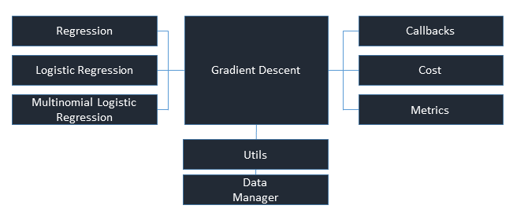

# Gradient Descent 1.0 Build
This is section __ of a 6-part series on Gradient Descent. In prior posts, we introduced gradient descent as a solution to unconstrained optimization problems. We've dug deeper into the mathematics behind gradient descent and by this stage, we should have a pretty solid understanding of how and why gradient descent works. In this section, we will build the core gradient descent functionality in Python. In the next section, we will run some experiments on real data to get a sense of how hyperparameters, such as learning rate and batch size, effect the performance.

> Why implement machine learning algorithms from scratch?

Why build gradient descent from scratch when there is no dearth of highly optimized and tested open-source packages and frameworks that I can use out-of-the-box without a deep understanding of optimization methods, gradients and loss functions. Is the return worth the investment in time? 

`r kfigr::figr(label = "feynman", prefix = TRUE, link = TRUE, type="Figure")`: (Richard Feynman, February 15, 1988) &copy; California Institute of Technology 

Well, there are several reasons why building an algorithm from scratch may make sense:

* **Learning motivation.** The relative ease with which existing libraries can be deployed can create the illusion of competence when the underlying data science is not well understood. Paraphrasing theoretical physicist, Richard Feynman, we don't understand that which we cannot create. Building machine learning algorithms deepens our intuition into the algorithm's behavior, reveals the effects of their hyperparameters and reinforces the underlying mathematical principles. Consequently we:    

  + gain a deeper appreciation for existing, battle-tested, and optimized implementations,   
  + adapt to new frameworks and APIs with greater agility,   
  + explain, with greater credibility, how and why an algorithm performs to colleagues and stakeholders    
  
* **Specialization** We may need to create a custom implementation because we are not satisfied with the 'features' of existing implementations. Suppose they don't support KL Divergence loss or cyclical learning rate schedules with stochastic gradient descent. Perhaps you've discovered a research paper describing an innovative approach to early stopping and you want to run computational complexity experiments. By implementing algorithms, we are able to fine-tune the functionality to suit specific project requirements. This can improve predictive or computational performance.

* **Experimentation** Once you've implemented a machine learning algorithm, you can perform studies to evaluate the predictive and computational performance of various parameters and new functionality. This can lead to new insights and discoveries for future implementations that you can contribute and promote.

## Design Tenents
Here we have an overview of the core functionality that we will be implementing. Starting on the left side of `r kfigr::figr(label = "basic_architecture", prefix = TRUE, link = TRUE, type="Figure")`, we have the three user facing interfaces: regression, logistic regression and multinomial logistic regression. It is only through these modules, classes and methods that the gradient descent functionality is accessed.

`r kfigr::figr(label = "basic_architecture", prefix = TRUE, link = TRUE, type="Figure")`: Gradient Descent Core Functionality

The regression classes are subclassed by the Gradient Descent class, the engine that iterates through the training set, renders predictions, computes the gradients, updates the parameters, and scores the model. 

On the right, we have supporting modules that perform callback functionality, compute costs, and define how various metrics are calculated and scored.

We will also have some data utilities such as batch generators. 

Batch, stochastic and mini-batch gradient descent are supported through the single gradient descent interface via the batch-size parameter. If batch_size is none, we will train using batch gradient descent. Alternatively, a batch_size of 1 implies stochastic gradient descent. Any other value would run mini-batch gradient descent.

That said, let's get coding. We'll take a bottoms-up approach, starting with the support classes, the utilities, then gradient descent and finally the regression modules.
