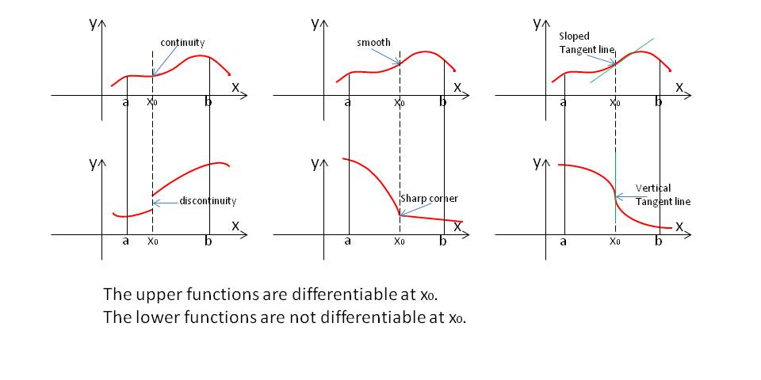
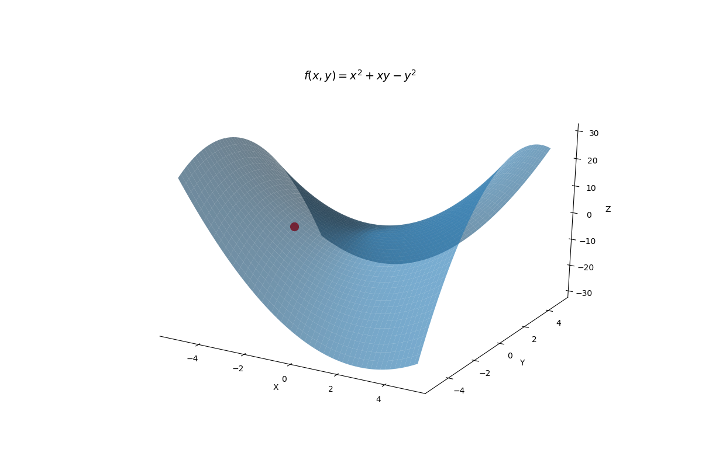
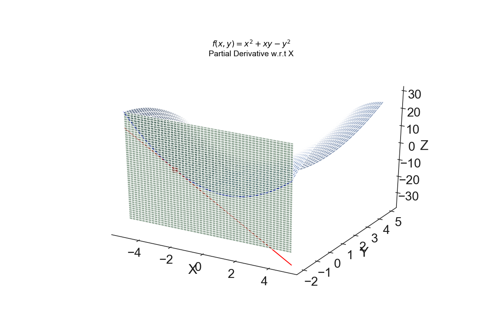
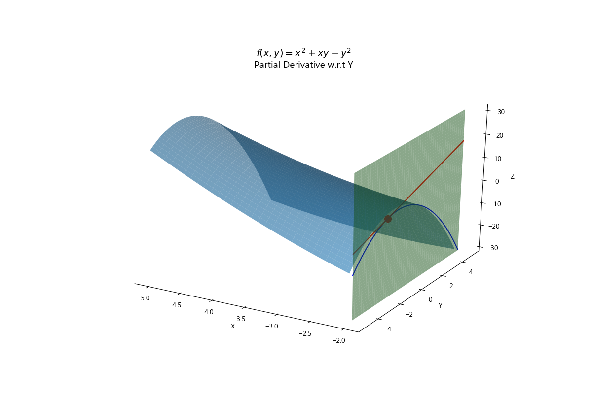

<script type="text/x-mathjax-config">
MathJax.Hub.Config({
TeX: {
equationNumbers: {
autoNumber: "all",
formatNumber: function (n) {return ''+n}
}
}});</script>

# Gradient Descent
This is section 1st of a _-part series,  Gradient Descent from Scratch. Gradient descent is among *the* most important algorithms in machine learning and is the defacto standard for optimizing deep learning networks. First introduced by Louis Augustin Cauchy in 1847 [@Cauchy1847Methode], Gradient Descent has evolved into a family of optimization algorithms and is now the workhorse behind state-of-the-art deep learning frameworks such as Keras [@chollet2015keras], TensorFlow [@tensorflow2015-whitepaper], Caffe [@jia2014caffe], Lasagne [@lasagne], and PyTorch [@paszke2017automatic], to name a few. 

https://cs231n.github.io/neural-networks-3/

Our objective here is to:   

1. developing the mathematical intuition behind Gradient Descent optimization
2. introduce the Gradient Descent algorithm
2. survey and contrast the Gradient Descent variants

With that, let's start with a question.

> What Problem Does Gradient Descent Solve?   

Gradient descent is about solving such *unconstrained optimization* problems. That is, for a *differentiable* objective function $f:\mathbb{R}^n \to \mathbb{R}$ defined on $n\ge1$-dimensional Euclidean space and a data vector $x\in\mathbb{R}^n$, the goal is:
$$\text{min} \space f(x)$$



`r kfigr::figr(label = "differentiability", prefix = TRUE, link = TRUE, type="Figure")`: Differentiability

As shown in the top row of `r kfigr::figr(label = "differentiability", prefix = TRUE, link = TRUE, type="Figure")`, a function that is differentiable at a point, say $x_0$ is one whose derivative exists at $x_0$. It has a (non-vertical) tangent line at that point, it is relatively smooth, and does not contain any breaks, bends, or cusps.

There are extensions of Gradient Descent that relax the differentiability assumption, but those are a subject for another post.

## Minimize Univariate Differentiable Function
Let's start with a relatively simple function $f : \mathbb{R} \to \mathbb{R}$ - the univariate differentiable function. How do we minimize this?

```{python convex_univariate, results='hide', code=readLines('../content/code/univariate.py')}
```
```{r convex_univariate_r, echo=FALSE}
htmltools::includeHTML("./content/figures/convex.html")
```
`r kfigr::figr(label = "convex_univariate", prefix = TRUE, link = TRUE, type="Figure")`: Convex univariate objective function

So, how would we minimize $f(x)$? Well, if we were at point $x$ on `r kfigr::figr(label = "convex_univariate", prefix = TRUE, link = TRUE, type="Figure")`, we observe that the graph is increasing to the left and decreasing to the right, so we move to the right. Starting at $x_1$, we move to the left to make $f$ as small as possible. In either case, we eventually arrive at the bottom of the basin, which happens to be the *global* minimum for $f$. 

To be more precise, the basic algorithm for minimizing a univariate $f(x)\in\mathbb{R}$ uses the derivative, $f^\prime(x)$, to determine the direction to move, and is given by:

While $f^\prime(x)\ne0$

  a. if $f^\prime(x)>0$, $f$ is increasing, move a $x$ a little to the left;
  b. if $f^\prime(x)<0$, $f$ is decreasing, move a $x$ a little to the right;

Not all objective functions are as agreeable as `r kfigr::figr(label = "convex_univariate", prefix = TRUE, link = TRUE, type="Figure")`. Consider `r kfigr::figr(label = "nonconvex_univariate", prefix = TRUE, link = TRUE, type="Figure")`. 
```{r nonconvex_univariate_r, echo=FALSE}
htmltools::includeHTML("./content/figures/nonconvex.html")
```
`r kfigr::figr(label = "nonconvex_univariate", prefix = TRUE, link = TRUE, type="Figure")`: Non-convex univariate objective function

If we start at $x$, we end up in the left basin, which happens to be the global minimum; however, If we start at $x_1$, we eventually arrive at a sub-optimal *local* minimum. 

The takeaway? Gradient descent is guaranteed to converge to a global minimum with convex objective functions. On the other hand, non-convex functions have multiple minima. As such, there is no guarantee that Gradient Descent will converge to the global minimum for such non-convex objective functions. 

Ça va for univariate functions. What about multivariate objective functions?

## Minimize Multivariate Linear Function
Let's now consider the linear function of the form:
$$f(x)=a^Tx+b$$
where:     

* $x \in \mathbb{R}^n$ is an $n$-vector,    
* $a \in \mathbb{R}^n$ is an $n$-vector, 
* $b \in \mathbb{R}$ is a scalar,      
* $n>1$     

If $n>1$, our optimization challenge just got complicated because we have an infinite number of directions in which to move, not just two as was the case with the univariate function.

Let's do a little experiment. The animation in `r kfigr::figr(label = "linear_search", prefix = TRUE, link = TRUE, type="Figure")` displays the surface for $f(x)=a^Tx + b$, where:    


$$a=\begin{bmatrix}-5\\-3\end{bmatrix},x=\begin{bmatrix}0\\0\end{bmatrix},\text{and}\: b=4$$ 
```{python f_x, eval=T, echo=T}
a = np.array([-5,-3])
x = np.array([0,0])
b = 4
def f(x, a, b):
    return np.dot(a.T, x) + b

```

```{r linear_search_r, echo=FALSE}
htmltools::includeHTML("./content/figures/linear_search.html")
```


`r kfigr::figr(label = "linear_search", prefix = TRUE, link = TRUE, type="Figure")`: Minimizing a multivariate function $f(x)\in\mathbb{R}^2$

We are currently at  $x^T=[0,0]$ and you wish to take a step of one unit of Euclidean distance in the direction that minimizes $f(x)$ the most. Adjust the slider to select a direction in degrees for a unit vector $\vec{u}$ and observe the value of $f(\vec{x}+\vec{u})$ which will appear once you've changed the direction using the slider widget. Which direction minimizes $f(x)$ the most? When you find it, note the coordinates of $\vec{u}$.

We can solve for $\vec{u}$ that minimizes $f(x)$ the most by using a bit of linear algebra. Note that moving from $x$ one unit of distance in the direction of $u$ changes our objective function as follows:

$$
\begin{align}
a^Tx + b & \to a^T(x+u)+b \\
& = a^Tx + b+a^Tu \\
& = a^Tx + b + \|a\|_2\space\|u\|_2\space \text{cos}\space\theta
\end{align}
$$
where $\theta$ denotes the angle between the vectors $a$ and $u$. To minimize the function, we must make $\text{cos}\space\theta$ as small as possible (i.e.-1). We do this by choosing $u$ to point in the opposite direction of $a$, which is the direction of steepest ascent, such that $\vec{u}=\frac{-\vec{a}}{\|\vec{a}\|}$. 

Let's solve for $u$ analytical, then compare it to our experimental result above. The formula for computing $\vec{u}$ in the opposite direction of $\vec{a}$ is given by:
$$\vec{u}=-\frac{1}{||\vec{a}||}\vec{a}$$
Let's solve for $\vec{u}$.
```{python u, eval=T, echo=T}
u = np.round(-a / (a**2).sum()**0.5,4)
```

Now, we can solve for $f(\vec{x}+\vec{u})$ as follows:
```{python f_u, eval=T, echo=T}
z = np.round(f(x+u, a, b), 4)
```

The unit vector $\vec{u}$ that minimizes $f(x)$ the most is [`r py$u[1]`,`r py$u[2]`] and the minimum value at $f(\vec{x}+\vec{u})$ is `r py$z`.  How close did you get?  Turns out the optimum direction is about 31 degrees. 

So, the main takeway is this. For linear functions, we minimize $f$ the most by moving in the direction of the **steepest descent**, $-a$ [@Roughgarden2018].

## Minimize General Differentiable Function
So, we've examined univariate and multivariate linear differentiable functions. How do we minimize *general* differentiable functions, ya know, the ones we actually care about.

> The key to minimizing any differentiable function, is to reduce it to a linear function.

This may sound glib, especially given the crazy forms differentiable functions can take. But calculus... uhh...uhh... finds a way! 

It turns out that any function differentiable at a point can be locally approximated at that point by a linear function. Once we have a local linear approximation of our function, we can use properties of differentiation to optimize the true function $f$. 

Let's check it out.

### Linear Approximation of Univariate Differentiable Function
The best local linear approximation of a univariate differentiable function at a point is the tangent line at that point. To show this, we'll: 

* formally define the notion of the derivative,      
* review the rules of differentiation,    
* interpret the tangent line as the best local linear approximation of a univariate differentiable function   

#### The Derivative
A function $f$ is said to be differentiable at $x$ if the following limit exists:
$$\displaystyle{\lim_{h \to0}}\Big[\frac{f(x+h)-f(x)}{h}\Big].$$
This limit is called the derivative of $f(x)$, denoted as $f^\prime(x)$. 

```{r derivative_as_limit, echo=FALSE}
htmltools::includeHTML("./content/figures/derivative.html")
```
`r kfigr::figr(label = "derivative_as_limit", prefix = TRUE, link = TRUE, type="Figure")`: Derivative as a Limit

To develop the intuition behind the derivative as a limit, consider the function $f(x)=x^2$ as specified in `r kfigr::figr(label = "derivative_as_limit", prefix = TRUE, link = TRUE, type="Figure")`. Select a value along the x-axis, say $x$, then designate the corresponding point on the curve, $P=f(x)$. Now, press play to move along the x-axis some distance $h$ from $x$ to a new point $x+h$, then plot the corresponding point $Q=f(x+h)$. Next, draw the secant line $PQ$ connecting the two points. Now for the crucial part. Reduce $h$ such that the variable point $Q$ approaches the fixed point $P$ by sliding along the curve. 

What do we notice? First, the secant changes direction as $Q$ approaches point $P$. As the absolute value of $h$ decreases, the value of $x+h$ approaches $x$, and the value of $f(x+h)$ approaches $f(x)$. It should be intuitively clear that the tangent line is the limit approached by the secant as $h\to0$. The slope of the secant line connecting the points ($x+h,f(x+h)$) and ($x,f(x)$) is the difference in the $y$ values over the difference between the $x$ values. This **difference quotient** becomes:
$$m=\frac{\Delta y}{h}=\frac{f(x+h)-f(x)}{h}$$
Hence small values of $h$ that approach zero render secant lines that are increasingly better approximations of the tangent line to $f(x)$ at $x$. Since the limiting position as $h \to 0$ of the secant line is the tangent line, the difference quotient as $h \to 0$, if it exists, will be the slope of the tangent line at ($x, f(x)$). This limit is defined as the *derivative* of the function $f$ at $x$:
$$f^\prime(x)=\lim_{h\to0}\frac{f(x+h)-f(x)}{h}$$

#### Rules of Differentiation
Differentiation is the process of finding the derivative of a differentiable function. There are two approaches to differentiation. One approach is to use the geometric definition, but this can be quite a slow and cumbersome process. Fortunately, we have a small number of rules that enable us to differentiate large classes of functions quickly.

For the following exhibit, let, $u=x^2$, $v=4x^3$, and $y=u^9$

`r kfigr::figr(label = "differential", prefix = TRUE, link = TRUE, type="Table")`: Differentiation Rules
```{r differential, results='asis'}
tbl <- "
|     Rule         |  Definition             |                    Example                   |
|------------------|:-----------------------:|:--------------------------------------------:|
| Constants Rule   | $\\frac{d}{dx}c=0$      |  $\\frac{d}{dx}5=0$|
| Power Rule   | $\\frac{d}{dx}x^n=nx^{n-1}$ |  $\\frac{d}{dx}v=12x^3$|
| Constant Factor Rule | $\\frac{d}{dx}(cu)=c\\frac{du}{dx}$| $\\frac{d}{dx}3x^2=3\\frac{d}{dx}x^2=6x$|
| Sum Rule | $\\frac{d}{dx}(u+v)=\\frac{du}{dx}+\\frac{dv}{dx}$ | $\\frac{d}{dx}(x^2+4x^3)=\\frac{d}{dx}x^2+\\frac{d}{dx}4x^3=2x+12x^2$|
| Subtraction Rule |$\\frac{d}{dx}(u-v)=\\frac{du}{dx}-\\frac{dv}{dx}$ | $\\frac{d}{dx}(x^2-4x^3)=\\frac{d}{dx}x^2-\\frac{d}{dx}4x^3=2x-12x^2$|
| Product Rule | $\\frac{d}{dx}(uv)=u\\frac{dv}{dx}+v\\frac{du}{dx}$ | $\\frac{d}{dx}(x^2\\times 4x^3)=x^2 \\times 12x^2 + 4x^3 \\times 2x$ |
| Quotient Rule | $\\frac{d}{dx}(\\frac{u}{v})=\\frac{v\\frac{du}{dx}-u\\frac{dv}{dx}}{v^2}$ for $v\\ne 0$ | $\\frac{d}{dx}(\\frac{u}{v})=\\frac{4x^3\\times 2x - x^2\\times 12x^2}{16x^6}$ |
| Chain Rule | $\\frac{dy}{dx}=\\frac{dy}{du}\\times \\frac{du}{dx}$ | $\\frac{dy}{dx} = 9u^8 \\times 2x = 9(x^2)^8 \\times 2x=18x^{17}$|

"
cat(tbl)
```

For practice, let's run through an example. 
$$\frac{d}{dx}\bigg[\frac{2x+4}{3x-1}\bigg]^3$$
1. Let $y=f(u)=u^3$ and $u=g(x)=\frac{2x+4}{3x-1}$    
2. Then $f^\prime(u)=3u^2$ by the power rule.    
3. Applying the quotient rule to obtain $g^\prime(x)$, we have    
$$\frac{d}{dx}\bigg[\frac{2x+4}{3x-1}\bigg]= \frac{(3x-1)(2)-(2x+4)(3)}{(3x-1)^2}=\frac{-14}{(3x-1)^2}$$
4. Hence, by the chain rule we have:  
$$
\begin{align}
F^\prime(x) & =f^\prime(g(x))\times g^\prime(x) \\
& = 3\bigg(\frac{2x+4}{3x-1}\bigg)^2 \times \frac{-14}{(3x-1)^2} \\
& = \frac{-42(2x+4)^2}{(3x-1)^4}
\end{align}
$$ 
As we've seen the rules of differentiation can allow us to find the derivatives relatively quickly without dealing with limits.  

So, we've introduced the concept of the derivative and put forward methods for computing it. We can now derive the equation for the tangent line. 

#### Tangent Line Equation
The change in $y$ over the change in $x$ is called the *difference quotient*, and is given by:
$$m=\frac{\Delta y}{h}=\frac{y-y_0}{x-x}=\frac{f(x+h)-f(x)}{(x+h)-x}=\frac{f(x+h)-f(x)}{h},$$
where $h=(x-x)$.

Using derivatives, we've shown that the slope $m$ approaches the slope of the tangent line $f^\prime(x)$ as $h\to0$. Substituting $f^\prime(x)$ for $m$ and rearranging into point slope form yields:
$$y=f(x)+f^\prime(x)(x-x).$$
So, the derivative is the slope of the tangent line at a point $x$.

#### Tangent Line: Best Local Linear Approximation
Recall calculus promises that, for a function $f(x)$ and a point suitably close to $x$, one can pretend that the true function $f$ is just a linear function at $f(x)$. This leads us to the most salient interpretation of the tangent line, and it is this.

> The tangent line of a univariate, differentiable function $f$ at point $x$ is the **best** local linear approximation of $f$ at $x$. 

If we were to zoom into the graph of a function $f$ at a point $x$ using a high-powered microscope (or look at it over a small enough interval), the curve of the function would appear to become increasingly straight. In fact, if we observe $f$ at the intersection of the tangent line, the curve and the tangent line would become qualitatively indistinguishable for all points *near* the point of intersection. 

That is the intuitive answer. Analytically? Consider the following Taylor series at $x$:
$$f(x+h)=f(x)+hf^\prime(x)+h^2f^{\prime\prime}(x)/2+\cdots$$
If you are not familiar with the Taylor series, it is just a representation of a function in terms of an *infinite sum* of the function's derivatives at a single point. Using Taylor's theorem, we can do two useful things: 

  1. approximate a function by using a *finite* number of terms of the Taylor series, and 
  2. quantify an estimate of the *error* introduced by the use of the Taylor approximation
  
Using the first three components of the Taylor series means that, for small $h$:
$$f(x+h)\approx f(x)+hf^\prime(x)+h^2f^{\prime\prime}(x)/2$$

We can quantify the error as:
$$E(x,h)=f(x+h)-(f(x)+hf^\prime(x))\approx h^2f^{\prime\prime}(x)/2$$
Now consider any other line through $(x,f(x))$ with slope $s$, with $s\ne f^\prime(x)$. At $x+h$, its value is $f(x)+sh$, and its error, $e(x,h,s)=f(x+h)-(f(x)+sh).$

Since $f(x+h)-f(x)\approx hf^\prime(x)+h^2f^{\prime\prime}(x)/2$, we can compute the associated error as: 
$$
\begin{equation}\begin{split}e(x,h,s) & =f(x+h)-(f(x)+sh) \\
& \approx hf^\prime(x)+h^2f^{\prime\prime}(x)/2-sh\\
&=h(f^\prime(x)-s)+h^2f^{\prime\prime}(x)/2
\end{split}
\end{equation},
$$
so that:
$$\frac{E(x,h)}{e(x,h,s)}\approx\frac{h^2f^{\prime\prime}(x)/2}{h(f^\prime(x)-s)+h^2f^{\prime\prime}(x)/2}=\frac{hf^{\prime\prime}(x)/2}{f^\prime(x)-s+hf^{\prime\prime}(x)/2}.$$
Since $s\ne f^\prime(x)$, as $h \to 0$, the numerator of the ratio of errors goes to zero while the denominator stays bounded away from zero.

Because, the error of the tangent lines goes to zero faster than the error of any other line through the point, the tangent line is the **best local linear approximation** to $f$ at $x$ [@Bivens1986]. 

Ok, we've adequately covered differentiability and differentation. We've examined univariate and multivariate linear equations and tangent line approximation. Let's move on to the general multivariate ideas behind Gradient Descent.

### Scalar and Vector Valued Functions
In general, there are two types of multivariate functions: scalar-valued functions and vector-valued functions. 

#### Scalar-Valued Functions
A multivariate scalar-valued function such $f(x,y)=x^2+y$ is a function in two variables. It takes input of $\mathbb{R^2}$ such as $(3,5)$ and returns a real-valued number of $\mathbb{R}$, like $f(3,5)=14$. Since $f$ maps $\mathbb{R^2}$ to $\mathbb{R}$, we write $f: \mathbb{R^2}\to\mathbb{R}$. A scalar-valued function can have any arbitrary number of variables. For instance $f(x,y,z)$, which we write as $f: \mathbb{R^3}\to\mathbb{R}$, is a scalar-valued function of three variables.

#### Vector-Valued Functions
In contrast, a vector-valued function takes one or more inputs and produces output in the form of a vector. First, let's examine vector-valued functions of a single variable. 

A single variable vector-value function such as 
$$
f(x) = 
\begin{bmatrix}
2x+3 \\
-x \\
\end{bmatrix}
,
$$
can be written as $f:\mathbb{R}\to\mathbb{R^2}$. For a given real-valued number, say $x=2$, we have:
$$
f(2) = 
\begin{bmatrix}
7 \\
-2 \\
\end{bmatrix}.
$$
Lastly, we have multiple variable vector-valued functions such as:
$$
f(x,y) = 
\begin{bmatrix}
2x+y \\
-x^y \\
\end{bmatrix}
,
$$
which can be written as $f: \mathbb{R^2}\to\mathbb{R^2}$. Again, multiple variable vector-valued functions may have any number of variables and dimensions.

With that, let's extend the concept of the derivative to the multivariable setting, starting with the partial derivative.

### Partial Derivative
The partial derivative of a multivariable function tells you how much the function changes as you tweak just one of the variables in its input. 

#### Visualizing the Partial Derivative
```{python partial, code=readLines('../content/code/partial.py')}
```

To graphically illustrate, let $f(x,y) = x^2+xy-y^2$ and consider the task of finding the partial derivative of $f(x,y)$ with respect to $x$ and $y$ at a $f(-2,-2)$. We can visualize the surface plot for the equation as follows. 



`r kfigr::figr(label = "multivariable", prefix = TRUE, link = TRUE, type="Figure")`: Surface plot for $f(x,y) = x^2+xy-y^2$

First, let's consider $\frac{\partial{f}}{\partial{x}}$, the partial derivative of $f$ with respect to $x$ This means that we treat $y$ as constant and compute the effect of small changes in $x$ on $f$. 

One way to visualize this is to inject a plane into the surface plot at some constant value for $y$.  Since we are seek the $\frac{\partial{f}}{\partial{x}}$ at $(-2,-2)$, let's plot a plane through the surface at $y=-2$.



`r kfigr::figr(label = "partial_x", prefix = TRUE, link = TRUE, type="Figure")`: Surface plot for $\frac{\partial{f}}{\partial{x}}$

The plane in `r kfigr::figr(label = "partial_x", prefix = TRUE, link = TRUE, type="Figure")`, provides a cross-section into $f$, revealing the behavior of the function for $y=-2$. The red line is the tangent line to $f$ at $(-2,-2)$ in the direction of the $x$ axis. The slope of the tangent line is  $\frac{\partial{f}}{\partial{x}}$, the partial derivative of $f$ with respect to $x$ at $(-2,-2)$.

Similarly, the graph of the $\frac{\partial{f}}{\partial{y}}$, the partial derivative of $f$ with respect to $y$ at $(-2,-2)$ is obtained by taking the cross-section into $f(x,y)$ at some constant value of $x$. This time we will take the cross section at $x=-2$.



`r kfigr::figr(label = "partial_y", prefix = TRUE, link = TRUE, type="Figure")`: Surface plot for $\frac{\partial{f}}{\partial{y}}$

The red tangent line in `r kfigr::figr(label = "partial_y", prefix = TRUE, link = TRUE, type="Figure")`, is the linear approximation of $f$ in the direction of the $y$ axis.  The slope of this tangent line is $\frac{\partial{f}}{\partial{y}}$, the partial derivative with respect to $y$ at $(-2,-2)$.

Now that we have a graphical intuition, let's review how the partial derivative of a multivariable function is computed.

#### Computing the Partial Derivative
Consider our function:
$$f(x,y) = x^2+xy-y^2$$
How would we evaluate $\frac{\partial{f}}{\partial{x}}$, the partial derivative with respect to $x$ at input $(-2, -2)$? 

The good news is that we use the same mechanics as an ordinary derivative. Since we only care about movement in the $x-$direction, we might as well treat the $y-$value as a constant.  In fact, we may can just plug in $y=-2$ into $f$ before computing any derivatives:
$$f(x,-2) = x^2+x(-2)-(-2)^2=x^2-2x+4$$
Now, $\frac{\partial{f}}{\partial{x}}$, the partial derivative with respect to $x$ is just an ordinary univarite derivative.
$$\frac{\partial}{\partial{x}}f(x,-2)=2x-2$$
Similarly, we can find $\frac{\partial{f}}{\partial{y}}$, the partial derivative with respect to $y$ by plugging in $x=-2$ into $f$:
$$f(-2,y) = (-2)^2+(-2)y-y^2=4-2y-y^2$$
Likewise, $\frac{\partial{f}}{\partial{y}}$, the partial derivative with respect to $y$ is just:
$$\frac{\partial}{\partial{y}}f(-2,y)=-2y-2$$
The previous example showed us how to compute the partial derivatives at a specific point. To generalize this, we need a way to compute the rates of change of $f$ near any point $(x,y)$. In other words, we need a new multivariable function which takes any point $(x,y)$ as input and tells us the rate of change of $f$ near that point as we move purely in the $x-$direction for $\frac{\partial{f}}{\partial{x}}$ or $y-$direction for $\frac{\partial{f}}{\partial{y}}$. 

To compute $\frac{\partial{f}}{\partial{x}}$, the partial derivative with respect to x for any $(x,y)$ we treat the $y$ variable as a constant, then take the derivative. Recall that the derivative of a constant is 0. Hence, 
$$\frac{\partial}{\partial{x}}f(x,y)=\frac{\partial}{\partial{x}}x^2+xy-y^2=2x+y.$$
Treating $x$ as a constant, we can compute $\frac{\partial{f}}{\partial{y}}$, the partial derivative with respect to $y$ as:
$$\frac{\partial}{\partial{y}}f(x,y)=\frac{\partial}{\partial{y}}x^2+xy-y^2=x-2y.$$

### The Gradient
Now that we've explored *partial* derivatives of multivariable functions, you may be wondering what *full* derivative of such a function is.  For **scalar-valued multivariable functions**, the answer is the gradient.

The gradient is the vector-valued, multivariable generalization of the derivative [@gradient]. The gradient of a scalar-valued multivariable function $f(x,y,...)$, denoted as $\nabla{f}$, packages all if its partial derivative information into a vector, e.g.:
$$
\nabla{f} = 
\begin{bmatrix}
\frac{\partial{f}}{\partial{x}} \\
\frac{\partial{f}}{\partial{y}} \\
\vdots
\end{bmatrix}
$$


#### Gradient Example in Two Dimensions
For example, let $f(x,y)=x^2+xy$, then the gradient is defined as:
$$
\nabla{f} = 
\begin{bmatrix}
\frac{\partial{f}}{\partial{x}} \\
\frac{\partial{f}}{\partial{y}} \\
\end{bmatrix}
= 
\begin{bmatrix}
2x+y \\
x \\
\end{bmatrix}
$$

#### Gradient Example in Three Dimensions   
In this example, let $f(x,y,z)=x-xy+z^2$, then the gradient at $f(3,3,3)$ is:
$$
\nabla{f} = 
\begin{bmatrix}
\frac{\partial{f}}{\partial{x}} \\
\frac{\partial{f}}{\partial{y}} \\
\frac{\partial{f}}{\partial{z}} \\
\end{bmatrix}
= 
\begin{bmatrix}
1-y \\
-x \\
2z \\
\end{bmatrix}
= 
\begin{bmatrix}
-2 \\
-3 \\
6 \\
\end{bmatrix}
$$

#### Interpreting the Gradient
The most germain interpretation of the gradient to optimization is that the gradient of a function $f$ is a vector that points in the direction of the **steepest ascent** of $f$ at a point.

To show this, we need to develop the concept of the **directional derivative**. The directional derivative is a generalization of the partial derivative that measures rates of change of a function in *any* arbitrary direction. First, we specify directions as unit vectors whose lengths equal 1. Let $\mathbb{u}$ be such a unit vector, $\|\mathbb{u}\|=1$. Then, let's define the *directional derivative* of $f$ in the direction of $\mathbb{u}$ as being the limit:
$$D_uf(a)=\lim_{h\to0}\frac{f(a+\textit{h}\mathbb{u})-f(a)}{\textit{h}}.$$
This is the rate of change of $f$ as $x\to a$ in the direction of $\mathbb{u}$. As we know, the tangent line is a good approximation of a single variable function at a point. Analogously, a multivariable function $f$, if differentiable, is well approximated by the tangent *plane*.  The linear function $g$ for the tangent plane is given by:
$$g(x)=f(a)+f_{x_1}(a)(x_1-a_1)+\dots +f_{x_n}(a)(x_n-a_n).$$
Therefore,
$$
\begin{align}
D_uf(a) & = \lim_{h\to0}\frac{f(a+hu)-f(a)}{h} \\
& = \lim_{h\to0}\frac{g(a+hu)-f(a)}{h} \\
& = \lim_{h\to0}\frac{f_{x_1}(a)hu_1+f_{x_2}(a)hu_2+\dots+f_{x_n}(a)hu_n}{h} \\
& = f_{x_1}(a)u_1+f_{x_2}(a)u_2+\dots+f_{x_n}(a)u_n,
\end{align}
$$
where $x_i \in x_1,x_2,\cdots ,x_n$ and $f_{x_i}=\frac{\partial{f}}{\partial{x_i}}$. 

Observe that the gradient of $f$ is $\begin{bmatrix}f_{x_1}(a),\\f_{x_2}(a),\\\dots\\f_{x_n}(a)\end{bmatrix}$. Hence the directional derivative is simply the dot product of the gradient and the direction
$$D_uf(a)=\nabla f(a)\cdot \mathbb{u}.$$

The gradient $\nabla f(a)$ is a vector in a specific direction. Let $\mathbb{u}$ be a unit vector in any direction, and let $\theta$ be the angle between $\nabla f(a)$ and $\mathbb{u}$. Now we can rewrite the directional derivative
$$D_uf(a)=\nabla f(a)\cdot\mathbb{u}=\|\nabla f(a)\|\|u\|\space cos\space\theta$$

Since $D_uf(a)$ is largest when $cos\space\theta=1$, $\theta$ must be 0. Hence, $u$ points in the direction of the gradient $\nabla f(a)$. So, we conclude that $\nabla f(a)$ points in the direction of the greatest increase of $f$, that is, the direction of the **steepest ascent**.

## Key Takeaways
We've covered a lot of territory. Let's summarize the main ideas.

* Gradient descent is an iterative approximation algorithm designed to solve unconstrained optimization problems of the form:

$$\text{min}\space f(x)$$
where $f(x)$ is an objective function $f:\mathbb{R^n}\to\mathbb{R}$ defined on $n \ge 1$-dimensional Euclidean space and $x\in\mathbb{R}^n$.

* We assume objective functions are differentiable, without vertical tangents, breaks, bends, and cusps.  
* Objective functions may be convex, with a single global optimum, or non-convex with several local minima and a global minimum. Gradient descent is guaranteed to converge to a global minimum for convex objective functions. There is no such guarantee for non-convex objective functions.     
* We minimize a univariate function by repeatedly taking small steps in the direction opposite to the derivative of the function.       
* By applying the 8 rules of differentiation, we can compute derivatives without messing around with limits.  
* To minimize a multivariate objective function, we move in the direction opposite to the gradient.    
* The partial derivative of a function $f$ with respect to one of its variables tells us how much the function changes as we tweak just one of the variables, leaving the others constant.   
* The directional derivative tells us the rate of change of a function in any arbitrary direction.    
* The gradient is the full derivative of a scalar-valued multivariate function, in the form of a vector which contains the partial derivatives with respect to each variable. We use the directional derivative to show that the gradient points in the direction of steepest ascent.

Thanks for your time and attention. In the next section, we will apply these ideas to regression and classification problems.
